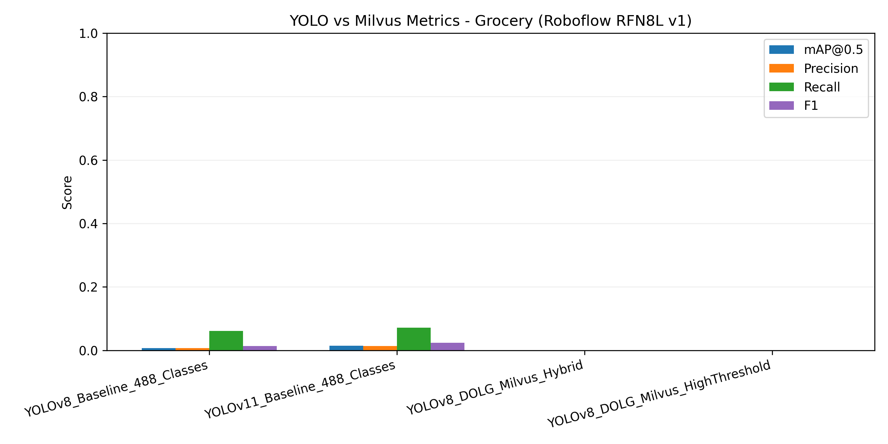
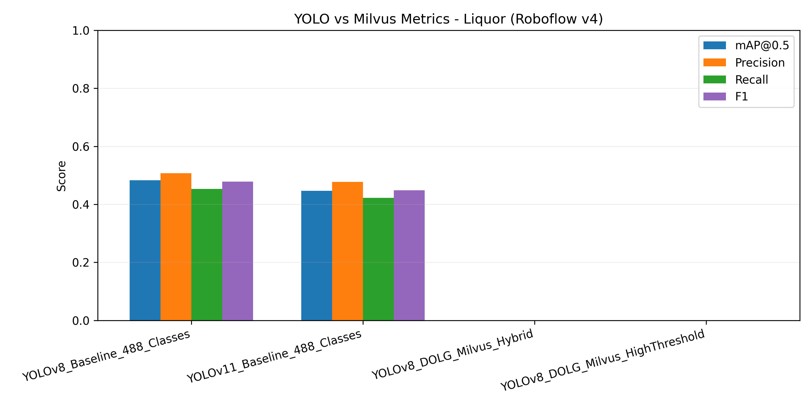

# YOLO + Milvus Embedding Experiments

A standalone research package that documents, reproduces, and publishes the YOLO detector versus Milvus embedding database comparison used in *Mechatronic Integration in Smart Point-of-Sale Systems*. It contains executable code, populated vector databases, metrics, logs, and figures so fellow researchers can replicate or extend the study.

## Repository Layout

```
yolo_embeding_malvious_repo/
├── yolo_vs_embeding_malvious/      # Experiment orchestration + Milvus tooling
├── experiments/
│   └── milvus_release/
│       ├── databases/              # Milvus Lite files (grocery + liquor)
│       ├── metrics/                # JSON summaries + per-experiment dumps
│       ├── logs/                   # Console logs for grocery/liquor runs
│       ├── figures/                # Publication-ready plots
│       └── README.md               # Step-by-step reproduction guide
├── Mechatronic Integration ...pdf  # Updated paper section referencing this release
└── README.md                       # You are here
```

Each directory is self-contained. You can open the root in VS Code, or treat `yolo_vs_embeding_malvious/` as a Python package while referencing the artifacts in `experiments/milvus_release/`.

## Datasets & Models

| Domain  | Dataset YAML                                  | Classes | Notes |
|---------|------------------------------------------------|---------|-------|
| Grocery | `data/roboflow/grocery-rfn8l-v1/data.yaml`     | 59      | Snack & beverage SKUs, minimal training (baseline weights) |
| Liquor  | `data/roboflow/liquor-data-v4/data.yaml`       | 414     | Fully trained YOLOv8m/YOLOv11 models (octal rig) |

Models evaluated:
- **YOLOv8m** baseline detectors (Ultralytics 8.3.221)
- **YOLOv11n** baseline detectors
- **YOLOv8 + DOLG + Milvus** hybrid pipelines with cosine similarity retrieval at thresholds 0.5 and 0.7

DOLG embeddings are extracted via an EfficientNet-B0 backbone (see `populate_milvus_embeddings.py`).

## Pipeline Overview

1. **Baseline Training / Evaluation** – `yolo_vs_embeding_malvious/run_experiments.py` orchestrates YOLOv8 and YOLOv11 evaluations using the dataset YAML paths above.
2. **Embedding Extraction** – `populate_milvus_embeddings.py` crops training samples, generates 128‑dim DOLG embeddings, and stores them inside Milvus Lite DB files.
3. **Hybrid Evaluation** – The orchestrator loads YOLO checkpoints alongside the Milvus DB and performs retrieval‑augmented detection.
4. **Reporting** – Metrics are saved to `experiments/milvus_release/metrics/*.json`, logs under `logs/`, and plots in `figures/`.

The Milvus Lite databases ship with the repo so researchers can immediately inspect or query the embeddings:

| Database File                                       | Collection      | Rows | Dim | Index |
|-----------------------------------------------------|-----------------|------|-----|-------|
| `experiments/milvus_release/databases/milvus_grocery.db` | `grocery_items` | 520  | 128 | FLAT (cosine) |
| `experiments/milvus_release/databases/milvus_liquor.db`  | `liquor_items`  | 3,873| 128 | FLAT (cosine) |

## Results Snapshot




*Grocery baselines remain low without fine-tuning; liquor YOLOv8m achieves ~0.48 mAP@0.5 and serves as the reference for hybrid retrieval.*

## Reproducing the Study

1. **Environment**
   ```bash
   python -m venv .venv
   source .venv/bin/activate
   pip install -r yolo_vs_embeding_malvious/requirements.txt
   ```
2. **Datasets** – Download the Roboflow projects referenced in the YAML files or point the configs to your local copies.
3. **Milvus Population (optional refresh)**
   ```bash
   python yolo_vs_embeding_malvious/populate_milvus_embeddings.py \
       --dataset data/roboflow/grocery-rfn8l-v1/data.yaml \
       --milvus-db experiments/milvus_release/databases/milvus_grocery.db \
       --collection grocery_items --max-templates 10 --batch-size 32 --device cuda:0
   # Repeat for liquor dataset
   ```
4. **Experiment Orchestration**
   ```bash
   python yolo_vs_embeding_malvious/run_experiments.py --config yolo_vs_embeding_malvious/experiment_config.yaml
   ```
   Rename the resulting `experiment_comparison.json` based on the dataset (e.g., `..._grocery.json`) and drop it in `experiments/milvus_release/metrics/` to keep the package current.
5. **Publishing / Sharing** – Use the workflow below to push this repo to GitHub:
   ```bash
   rm -rf .git
   git init
   git add .
   git commit -m "YOLO + Milvus release"
   git remote add origin https://github.com/sam02425/yolo_embeding_malvious.git
   git branch -M main
   git push -u origin main
   ```

## References

- Ultralytics YOLO: https://docs.ultralytics.com
- Milvus Lite: https://milvus.io/docs/install_standalone-docker.md
- Roboflow Datasets: https://universe.roboflow.com

Questions or contributions? Open an issue in the GitHub repository once you publish this bundle.
